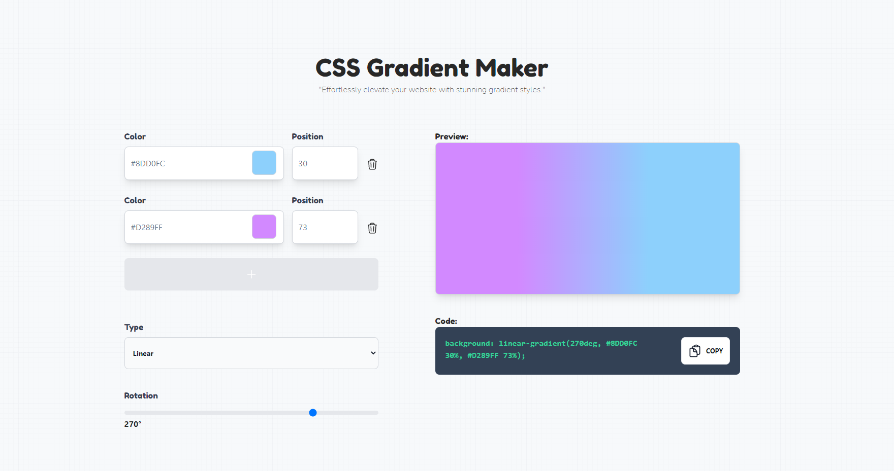

# CSS Gradient Maker

A tool that creates CSS code for a gradient of two or more colors, which can be used to style elements with a smooth transition between colors.

### Screenshot

### Built with

- TailwindCSS
- Vue 3 & Nuxt 3
- Plugin such as:
  * vue-basic-alert
  * vue-color-input
  * clipboard
